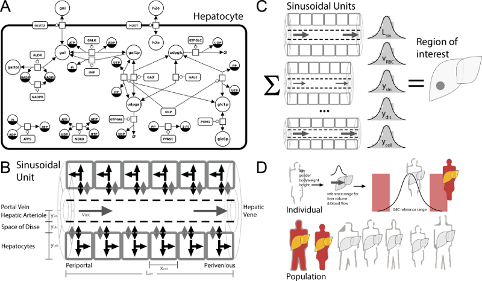
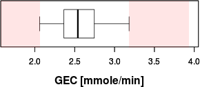
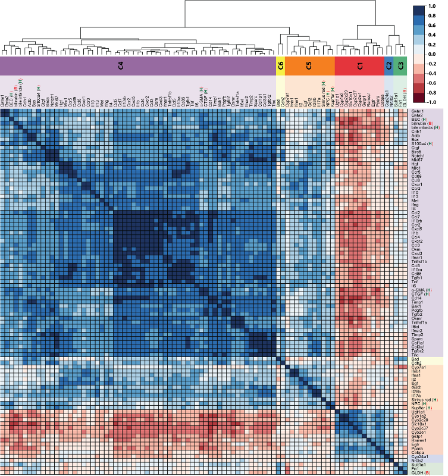

 

      

        <h1>Multiscale-galactose metabolism</h1>
        
Multiscale model of human galactose metabolism - from single hepatocytes to individual liver function. 

        
        
          

          
            
          
          
            
          
          
            
          
          

          

            {{ publication.authors }} 
            <i>{{ publication.title }}</i> 
            {{ publication.journal }}
          

        
        
        <h3>Model overview</h3>
        

          
        

        
        <h3>GEC App</h3>
        
Calculation of individual liver function based on Galactose Elimination Capacity (GEC).

        

          
          <b><a href="./gec_app/" target="_blank">GEC App</a></b>
        

        
        <h1>Pathobiochemical signatures of cholestatic liver disease</h1>
        
        
        
          

          
            
          
          
            
          
          
            
          
          

          

            {{ publication.authors }} 
            <i>{{ publication.title }}</i> 
            {{ publication.journal }}
          

        
        

      

          
      

        
      

    
<!-- /.container -->

  <!--
  <h1 class="page-heading">Posts</h1>

  <ul class="post-list">
    
      <li>
        {{ post.date | date: "%b %-d, %Y" }}

        <h2>
          <a class="post-link" href="{{ post.url | prepend: site.baseurl }}">{{ post.title }}</a>
        </h2>
      </li>
    
  </ul>

  
subscribe <a href="{{ "/feed.xml" | prepend: site.baseurl }}">via RSS</a>

  -->

